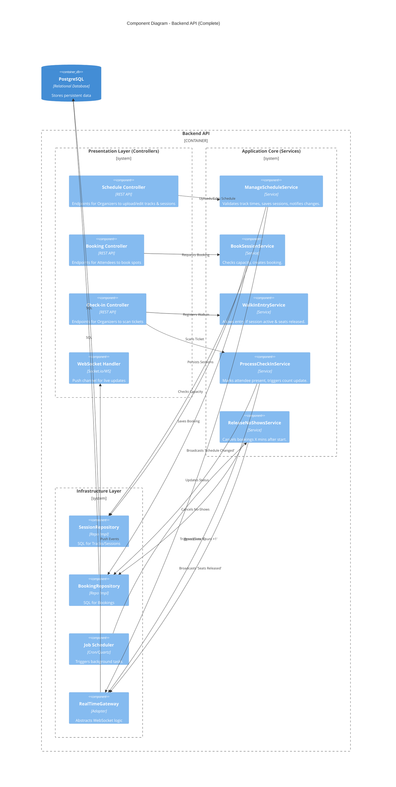

# Component Diagram - Backend API (Complete)

```mermaid

C4Component
title Component Diagram - Backend API (Complete)
ContainerDb(db, "PostgreSQL", "Relational Database", "Stores persistent data")
Container_Boundary(api, "Backend API") {
    Boundary(presentation, "Presentation Layer (Controllers)") {
        Component(schedule_ctrl, "Schedule Controller", "REST API", "Endpoints for Organizers to upload/edit tracks & sessions")
        Component(booking_ctrl, "Booking Controller", "REST API", "Endpoints for Attendees to book spots")
        Component(checkin_ctrl, "Check-in Controller", "REST API", "Endpoints for Organizers to scan tickets")
        Component(ws_handler, "WebSocket Handler", "Socket.io/WS", "Push channel for live updates")
    }
    Boundary(core, "Application Core (Services)") {
        Component(manage_svc, "ManageScheduleService", "Service", "Validates track times, saves sessions, notifies changes.")
        Component(book_svc, "BookSessionService", "Service", "Checks capacity, creates booking.")
        Component(walkin_svc, "WalkInEntryService", "Service", "Allows entry if session active & seats released.")
        Component(checkin_svc, "ProcessCheckInService", "Service", "Marks attendee present, triggers count update.")
        Component(release_svc, "ReleaseNoShowsService", "Service", "Cancels bookings X mins after start.")
    }
    Boundary(infra, "Infrastructure Layer") {
        Component(session_repo, "SessionRepository", "Repo Impl", "SQL for Tracks/Sessions")
        Component(booking_repo, "BookingRepository", "Repo Impl", "SQL for Bookings")
        Component(scheduler, "Job Scheduler", "Cron/Quartz", "Triggers background tasks")
        Component(rt_gateway, "RealTimeGateway", "Adapter", "Abstracts WebSocket logic")
    }
}
Rel(schedule_ctrl, manage_svc, "Uploads/Edits Schedule")
Rel(manage_svc, session_repo, "Persists Sessions")
Rel(manage_svc, rt_gateway, "Broadcasts 'Schedule Changed'")
Rel(booking_ctrl, book_svc, "Requests Booking")
Rel(book_svc, booking_repo, "Saves Booking")
Rel(book_svc, session_repo, "Checks Capacity")
Rel(checkin_ctrl, checkin_svc, "Scans Ticket")
Rel(checkin_ctrl, walkin_svc, "Registers Walk-in")
Rel(checkin_svc, booking_repo, "Updates Status")
Rel(checkin_svc, rt_gateway, "Broadcasts 'Count +1'")
Rel(scheduler, release_svc, "Triggers (Time X)")
Rel(release_svc, booking_repo, "Cancels No-Shows")
Rel(release_svc, rt_gateway, "Broadcasts 'Seats Released'")
Rel(rt_gateway, ws_handler, "Push Events")
Rel(session_repo, db, "SQL")
Rel(booking_repo, db, "SQL")
```
