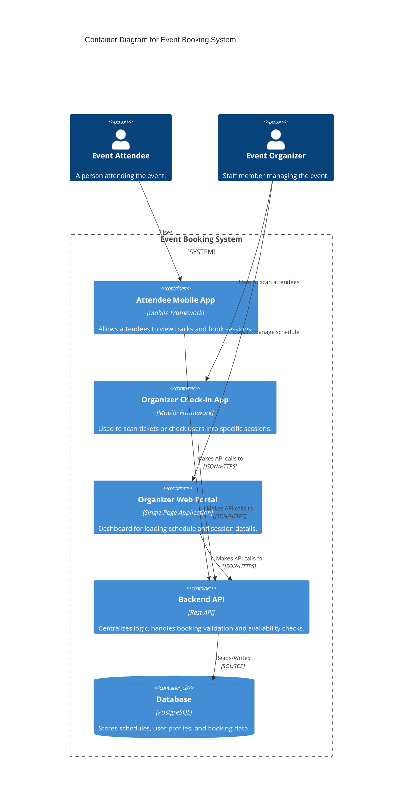

# Container Diagram for Event Booking System

```mermaid

C4Container
title Container Diagram for Event Booking System
Person(attendee, "Event Attendee", "A person attending the event.")
Person(organizer, "Event Organizer", "Staff member managing the event.")
System_Boundary(c1, "Event Booking System") {
    Container(attendee_app, "Attendee Mobile App", "Mobile Framework", "Allows attendees to view tracks and book sessions.")
    Container(checkin_app, "Organizer Check-in App", "Mobile Framework", "Used to scan tickets or check users into specific sessions.")
    Container(org_webapp, "Organizer Web Portal", "Single Page Application", "Dashboard for loading schedule and session details.")
    Container(backend_api, "Backend API", "Rest API", "Centralizes logic, handles booking validation and availability checks.")
    ContainerDb(db, "Database", "PostgreSQL", "Stores schedules, user profiles, and booking data.")
}
Rel(attendee, attendee_app, "Uses")
Rel(organizer, org_webapp, "Uses to manage schedule")
Rel(organizer, checkin_app, "Uses to scan attendees")
Rel(attendee_app, backend_api, "Makes API calls to", "JSON/HTTPS")
Rel(org_webapp, backend_api, "Makes API calls to", "JSON/HTTPS")
Rel(checkin_app, backend_api, "Makes API calls to", "JSON/HTTPS")
Rel(backend_api, db, "Reads/Writes", "SQL/TCP")
```
