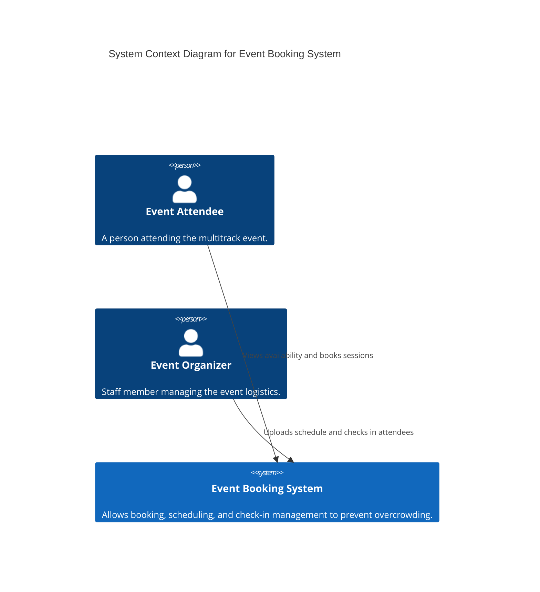

# System Context Diagram for Event Booking System

```mermaid

C4Context
title System Context Diagram for Event Booking System
Person(attendee, "Event Attendee", "A person attending the multitrack event.")
Person(organizer, "Event Organizer", "Staff member managing the event logistics.")
System(event_system, "Event Booking System", "Allows booking, scheduling, and check-in management to prevent overcrowding.")
Rel(attendee, event_system, "Views availability and books sessions")
Rel(organizer, event_system, "Uploads schedule and checks in attendees")
```
