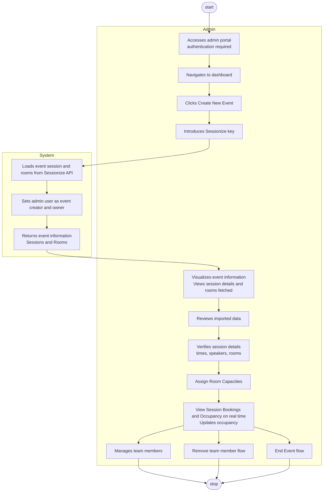

# Detailed Admin Flow for Creating an Event

Admin vs System actions.

```mermaid

flowchart TB
    subgraph Admin
        direction TB
        A1[Accesses admin portal<br/>authentication required]
        A2[Navigates to dashboard]
        A3[Clicks Create New Event]
        A4[Introduces Sessionize key]
        A5[Visualizes event information<br/>Views session details and rooms fetched]
        A6[Reviews imported data]
        A7[Verifies session details<br/>times, speakers, rooms]
        A8[Assign Room Capacities]
        A9[View Session Bookings and Occupancy on real time<br/>Updates occupancy]
        A10[Manages team members]
        A11[Remove team member flow]
        A12[End Event flow]
    end

    subgraph System
        direction TB
        S1[Loads event session and rooms from Sessionize API]
        S2[Sets admin user as event creator and owner]
        S3[Returns event information<br/>Sessions and Rooms]
    end

    Start([start]) --> A1 --> A2 --> A3 --> A4
    A4 --> S1 --> S2 --> S3
    S3 --> A5 --> A6 --> A7 --> A8 --> A9
    A9 --> A10
    A9 --> A11
    A9 --> A12
    A10 --> Stop([stop])
    A11 --> Stop
    A12 --> Stop
```
