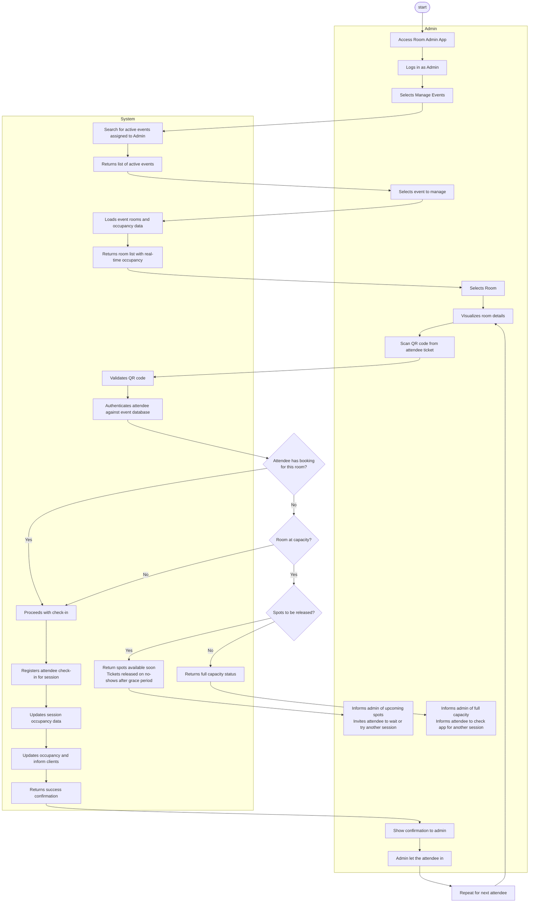

# Admin Flow for Room Check-In

```mermaid

flowchart TB
    subgraph Admin
        direction TB
        A1[Access Room Admin App]
        A2[Logs in as Admin]
        A3[Selects Manage Events]
        A4[Selects event to manage]
        A5[Selects Room]
        A6[Visualizes room details]
        A7[Scan QR code from attendee ticket]
        A8[Informs admin of upcoming spots<br/>Invites attendee to wait or try another session]
        A9[Informs admin of full capacity<br/>Informs attendee to check app for another session]
        A10[Show confirmation to admin]
        A11[Admin let the attendee in]
    end

    subgraph System
        direction TB
        S1[Search for active events assigned to Admin]
        S2[Returns list of active events]
        S3[Loads event rooms and occupancy data]
        S4[Returns room list with real-time occupancy]
        S5[Validates QR code]
        S6[Authenticates attendee against event database]
        S7[Return spots available soon<br/>Tickets released on no-shows after grace period]
        S8[Returns full capacity status]
        S9[Proceeds with check-in]
        S10[Registers attendee check-in for session]
        S11[Updates session occupancy data]
        S12[Updates occupancy and inform clients]
        S13[Returns success confirmation]
    end

    Start([start]) --> A1 --> A2 --> A3
    A3 --> S1 --> S2 --> A4
    A4 --> S3 --> S4 --> A5
    A5 --> A6 --> A7
    A7 --> S5 --> S6
    S6 --> HasBooking{Attendee has booking<br/>for this room?}
    HasBooking -->|No| AtCap{Room at capacity?}
    AtCap -->|Yes| Spots{Spots to be released?}
    Spots -->|Yes| S7 --> A8
    Spots -->|No| S8 --> A9
    AtCap -->|No| S9
    HasBooking -->|Yes| S9
    S9 --> S10 --> S11 --> S12 --> S13
    S13 --> A10 --> A11
    A11 --> Next[Repeat for next attendee]
    Next --> A6
```
